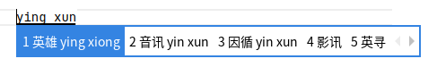

# 雾凇拼音-plus

雾凇拼音-plus 是雾凇拼音的增强版本，在原生雾凇拼音的基础上增加了以下功能：

- 云输入法支持
- 翻译功能(支持中英互译)
- 英文输入
- 错误拼音提示

这些功能使用纯 Lua + curl 命令方式实现，不依赖外部 C 库和 Lua socket 库，避免因 Lua 版本不一致导致的兼容性问题。

## 功能特性

### 错误拼音注释

自动识别错误拼音并给出正确提示，帮助纠正发音：

- 输入 ying yu，候选词是"音乐"时会提示 yin yue（音的正确发音是 yin）

  

- 输入 yingxun 时会提示 yingxiong

  

### 云输入法

- 快捷键: Ctrl + t 触发百度云输入(可自定义)
- 支持全键盘输入
- 实时联网查询补全

### 翻译功能

支持中英互译:

- 汉译英: Ctrl + e

  
  

- 英译汉: Ctrl + h

  
  

## 系统要求

- curl 工具(用于云输入和翻译功能)
- 云输入和翻译暂不支持 Android 设备
- 错误拼音提示支持 Android 端

## 注意事项

- 修改 yaml 配置文件时需严格保持缩进对齐
- 首次使用需配置环境变量

## 安装说明

详细安装步骤请参考 [Rime-ice 文档](https://github.com/iDvel/rime-ice)
